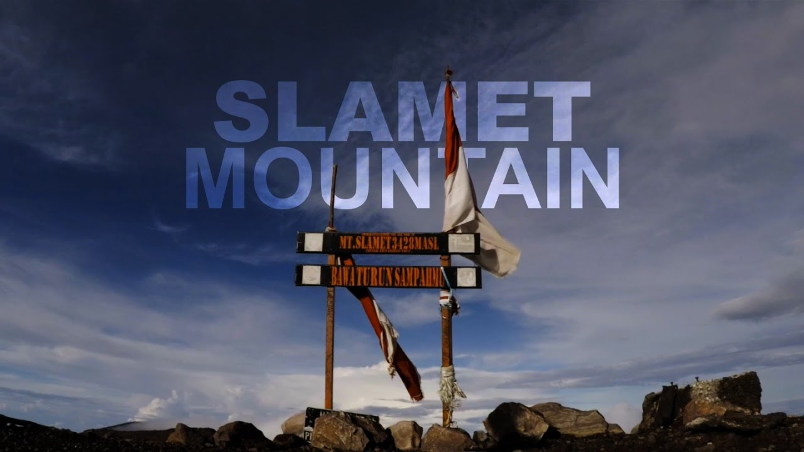
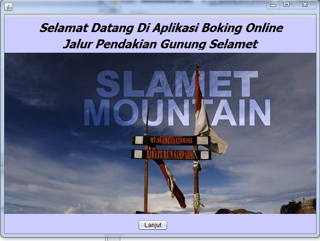
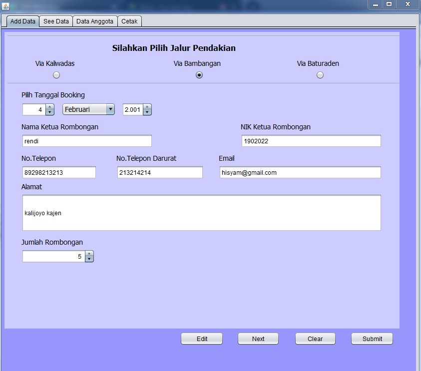
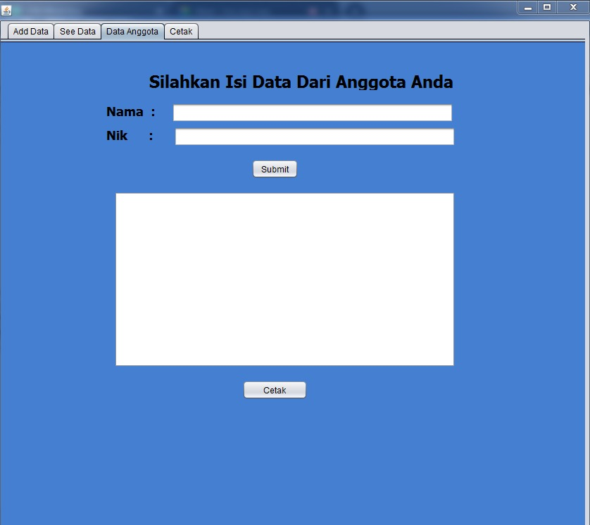
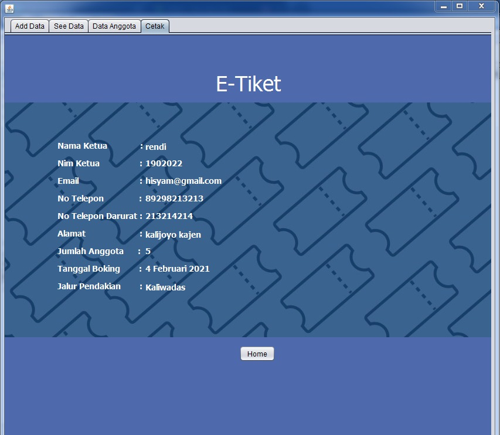

# Aplikasi Booking Online Jalur Pendakian Gunung Slamet
<b>Nine One One</b>
 Cahya Aprilia Putranti as Project Manager
 Adelia Sannomiya as Analyst
 Rendi as Designer
 Hisyam Setiawan as Programmer

<b>Description:</b>

Aplikasi Jalur Pendakian Gunung Slamet ini yaitu aplikasi booking tiket untuk jalur pendakian yang akan di lewati oleh para pendaki. Systemnya yaitu yang pertama user di minta untuk memilih jalur mana yang akan di lalui nantinya, untuk harga setiap jalur itu berbeda beda tergantung medannya. Kemudian user di minta untuk menginputkan tanggal pendakian, jumlah orang yang mendaki dengan perwakilan 1 orang sebagai penanggung jawab timnya dan menginputkan identitas masing masing. Setelah semua data sudah benar dan klik selesai, user akan mendapatkan e-ticket untuk melakukan pembayaran. Pembayaran tersebut di lakukan secara langsung di pos reservasi ticketnya. Tujuan dari aplikasi ini yaitu mempermudah registrasi pendakian gunung. Karena di era pandemi ini, pendaki sudah menggunakan kuota untuk jumlah pendaki yang akan naik gunung.

<b>Preview:</b>
 HOME

ADD DATA

ADD MEMBER

PRINT

